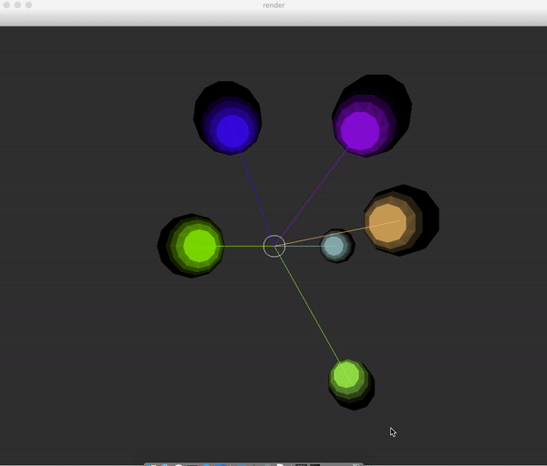

# Програмирование на Python: классы и визуализация
В курсе будет рассмотрено применения классов в языке Python для создания физического симулятора. Будет представлен пример использования объектно-ориентированного подхода к построению программ, изучены базовые приемы проектирования гибкой и расширяемой архитектуры. На лекциях планируется ознакомление с библиотекой OpenCV, методами визуализации и последовательной реализации системы с желаемым поведением.
## Лекции на youtube: 

https://www.youtube.com/playlist?list=PLEvAmOZOOI2aXPBiS8Alvrz4Ya85uayeU

## План курса

  1) На лекции будут рассмотрены основные понятия компьютерного зрения (представление изображения в компьютере, фильтры), рисование графических примитивов с помощью библиотеки OpenCV, будет рассказано о месте зрения в программном комплексе гуманоидного робота и связи с другими модулями. Будет кратко рассказано о базовых и производных классах (с одновременной демонстрацией процесса написания кода), будет реализован простой физический симулятор с несколькими типами фигур (круг, квадрат, треугольник, линия), отталкивающимися от стен. Будут изложены методы наглядной визуализации на примере связи координаты и цвета, а также обработка простых сигналов с клавиатуры.
    

  2) В симулятор будет добавлен эффект гравитации, отслеживание с помощью графиков кинетической, потенциальной и полной энергии в режиме реального времени. Будет дан обзор физических моделей столкновений объектов (реализация планируется на 3 лекции). Будут даны примеры использования лямбда-функций и функций как параметров для вычисления цвета как функции координат и скоростей. Будет рассказано о типах данных, будут введены вещественные скорости объектов, генерация объектов произвольного типа с произвольными характеристиками. Будут изложены предпосылки к введению дополнительного уровня абстракции для удобства работы с объектами любого типа (реализация планируется на 3 лекции).
  
  
  3) На лекции будут рассмотрены модели освещения и реализована модель освещение Ламберта. Будет дано понятие поверхности с точки зрения визуализации, будет построена модель точечного источника света. Планируется написание программы, позволяющей изменять положение источника света с одновременной визуализацией результата. Если останется время, будет реализована модель освещения плоскости.
  

  4) На лекции будут рассмотрены методы оптимизации построения освещения, в том числе триангуляция, игнорирование закрытых областей, предподсчет различных состояний объектов и использование симметрий для уменьшения вычислительной сложности процесса.
  
  

  5) На семинаре планируется рассмотрение рекурсивных алгоритмов: вычисления чисел Фибоначчи, построение двумерных рекурсивных деревьев, построение рандомизированных деревьев и небинарных деревьев. Будут рассмотрены варианты добавления циклического и рандомизированного поведения деревьев во времени. Затем генерация деревьев будет совмещена с освещением триангулированных поверхностей с предыдущего семинара и выведена в трехмерное пространство. Будет рассмотрен метод построения модели горного ландшафта на основе рандомизированных деревьев. В конце семинара будет кратко рассмотрена программа для построения окрашенного множества Мандельброта, будет дано представление о сходимости последовательностей. Если останется время, будет введена размерность Хаусдорфа в применении к анализу размерностей различных объектов в R^2.
  
  

  6) Семинар будет посвящен сборке всех разработанных программ в модель Солнечной системы с гравитирующей массой, будут рассмотрены простые модели симуляции гравитации с неоднородными полями, будет дано представление о построении моделей с полем, имеющим ненулевой ротор. Будет построена иерархическая система объектов: Солнце, планеты, спутники планет и метеорные кольца.
  
  
  7) На семинаре будет продолжено рассмотрение рекурсивных деревьев, в частности с добавлением циклического изменения параметров во времени, и фракталов. Генерация рекурсивных деревьев продолжится в трехмерном пространстве на основе построенной на предыдущих семинарах модели освещения триангулированных объектов. Будут рассмотрены различные подходы к построению самоподобных структур: итеративный и рекурсивный (на примере губки Менгера глубины 3), а также параметрическая генерация множеств на основе Кривой Дракона.
  
  

8) В завершающем курс семинаре планируется интеграция написанных модулей в простую игру. Будет рассмотрена формализация уровня, создание меню и сохранений. В конце семинара будет дан обзор методов оптимизации рендеринга трехмерных объектов и некоторых более сложных моделей освещения, а также расширенная секция ответов на вопросы по всему курсу.

  
